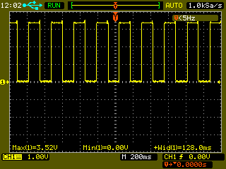

lnx
===

Misc tests/projects/patches for linux.

__gpio_test__

Simple test driver for gpio. Allows manipulating gpio output value. Gpio number is set as driver parameter. To write 0 or 1 one needs to do `echo 0 > /dev/gpio_test` or `echo 1 > /dev/gpio_test`.

modinfo:

```
root@omapl138-lcdk:~# modinfo gpio_test.ko
  filename:       gpio_test.ko
  description:    Gpio test driver.
  author:         Michael Likholet <m.likholet@ya.ru>
  license:        GPL
  depends:        
  vermagic:       3.1.10 preempt mod_unload modversions ARMv5 
  parm:           gpio_num:ushort
```
how to use:

1. Build driver
  ```

    ┌─(11:29:09)─(michael@host)─(~/Proj/free/linux/gpio_driver/lnx/gpio_test)
    └─► make
    Make module...                                                                                            
    make[1]: Entering directory `/home/michael/ti/linux-3.1.10'                                               
    CC [M]  /home/michael/Proj/free/linux/gpio_driver/lnx/gpio_test/gpio_test.o                             
    /home/michael/Proj/free/linux/gpio_driver/lnx/gpio_test/gpio_test.c: In function 'gpio_test_cdev_start':  
    /home/michael/Proj/free/linux/gpio_driver/lnx/gpio_test/gpio_test.c:99:2: warning: format not a string lit
    Building modules, stage 2.                                                                              
    MODPOST 1 modules                                                                                       
    CC      /home/michael/Proj/free/linux/gpio_driver/lnx/gpio_test/gpio_test.mod.o                         
    LD [M]  /home/michael/Proj/free/linux/gpio_driver/lnx/gpio_test/gpio_test.ko                            
    make[1]: Leaving directory `/home/michael/ti/linux-3.1.10'
  ```
2. Copy it to filesystem and insert it.
  ```
    root@omapl138-lcdk:~# insmod gpio_test.ko gpio_num=43
  ```

3. Have fun.
  ```
    root@omapl138-lcdk:~# while sleep 0.1; do echo 1 > /dev/gpio_test; sleep 0.1; echo 0 > /dev/gpio_test; done;
  ```
4. Now you can take the probe and see result:

  


__omap_l138__

Patch for __omap-l138__ kernel ([TI LCDK module](http://www.ti.com/tool/tmdxlcdk138)):

- Enables CLKOUT (24MHz, internal clock) at TP10, which is used as clock source for external camera connected to J16.

- Setup reset pin for camera.

- Setup all the pins for camera (DIN0-DIN15).

- Added driver for ov5642 to config.

- ov5642 enumerated in i2c board info.
